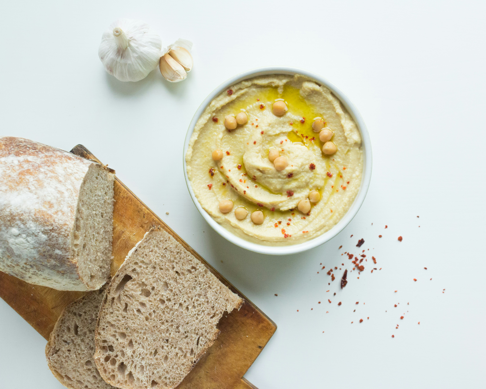

# Menu 

## Pizza klasyczna

|Lp.|nazwa | rozmiar: | 30 cm | 50 cm | 60 cm |
|---|-------------------------------------------|---|---|---|--------|
|1. |MARGHERITA (sos pomidorowy, ser, oregano)| |20 zł| 30 zł | 40 zł |
|2. |FUNGHI (sos pomidorowy, ser, pieczarki)| |22 zł| 32 zł | 42 zł |
|3. |SALAMI (sos pomidorowy, ser, salami)| |22 zł| 32 zł | 42 zł |
|4. |VESUVIO (sos pomidorowy, podwójny ser, szynka)| |25 zł| 35 zł | 45 zł |
|5. |MILANO (sos pomidorowy, ser, szynka, papryka, oregano)| |25 zł| 35 zł | 45 zł |
|6. |HAWAJSKA (sos pomidorowy, ser, szynka, ananas)| |26 zł| 36 zł | 46 zł |
|7. |QUATTRO FROMAGGI (sos pomidorowy, 4 sery, oregano)| |27 zł| 37 zł | 47 zł |
|8. |GRECKA (sos pomidorowy, ser, oliwki, feta, sałata lodowa)| |28 zł| 38 zł | 48 zł |

## Pizza calzone

|Lp.|nazwa | rozmiar: | 30 cm | 50 cm | 60 cm |
|---|-------------------------------------------|---|---|---|--------|
|1. |KEBAB (sos pomidorowy, ser, kebab, sos czosnkowy)| |26 zł| 36 zł | 46 zł |
|2. |GRECKA (sos pomidorowy, ser, oliwki, feta, sałata lodowa)| |28 zł| 38 zł | 48 zł |
|3. |BARBEQUE (sos pomidorowy, ser, kurczak, boczek, cebula, sos barbeque)| |30 zł| 40 zł | 50 zł |

## Pizza wegetariańska

|Lp.|nazwa | rozmiar: | 30 cm | 50 cm | 60 cm |
|---|-------------------------------------------|---|---|---|--------|
|1. |MARGHERITA (sos pomidorowy, ser, oregano)| |20 zł| 30 zł | 40 zł |
|2. |FUNGHI (sos pomidorowy, ser, pieczarki)| |22 zł| 32 zł | 42 zł |
|3. |MILANO VEGE (sos pomidorowy, ser, papryka, oregano)| |25 zł| 35 zł | 45 zł |
|4. |HAWAJSKA VEGE (sos pomidorowy, ser, ananas)| |26 zł| 36 zł | 46 zł |
|5. |GRECKA (sos pomidorowy, ser, oliwki, feta, sałata lodowa)| |28 zł| 38 zł | 48 zł |

## Makarony

|Lp.|nazwa | porcja: | 500g | 650g |
|---|-------------------------------------------|---|------|--------|
|1. |SPAGHETTI NAPOLI (makaron z sosem pomidorowym i serem)| |24 zł| 44 zł |
|2. |PENNE Z ŁOSOSIEM (makaron ze śmietaną, łososiem i pietruszką)| |24 zł| 44 zł |
|3. |SPAGHETTI CARBONARA (makaron z sosem carbonara)| |28 zł| 48 zł |

## Sałatki

1. Cesar (sałata, cebula, oliwa z oliwek, pomidor) - 18 zł
2. Grecka (sałata, cebula, oliwa z oliwek, pomidor, oliwki, geta) - 20 zł
3. Hiszpańska (sałata, cebula, oliwa z oliwek, pomidor, oliwki, mozarella) - 25 zł

## Sosy

1. Czosnkowy - 5 zł
2. Pomidorowy - 5 zł
3. Majonezowy - 5 zł
4. Serowy - 5 zł
5. Sambal - 5 zł

## Dodatki
1. Cukinia - 5 zł
2. Karczochy - 6 zł
3. Krewetki - 10 zł
 
## Napoje

|Lp.|napój: | pojemność: | 300ml | 500ml |
|---|-------------------------------------------|---|------|--------|
|1. |Woda| |5 zł| 10 zł |
|2. |Sok pomarańczowy| |7 zł| 12 zł |
|3. |Sok jabłkowy | |7 zł| 12 zł |
|4. |Lemoniada domowa | |16 zł| 22 zł |
